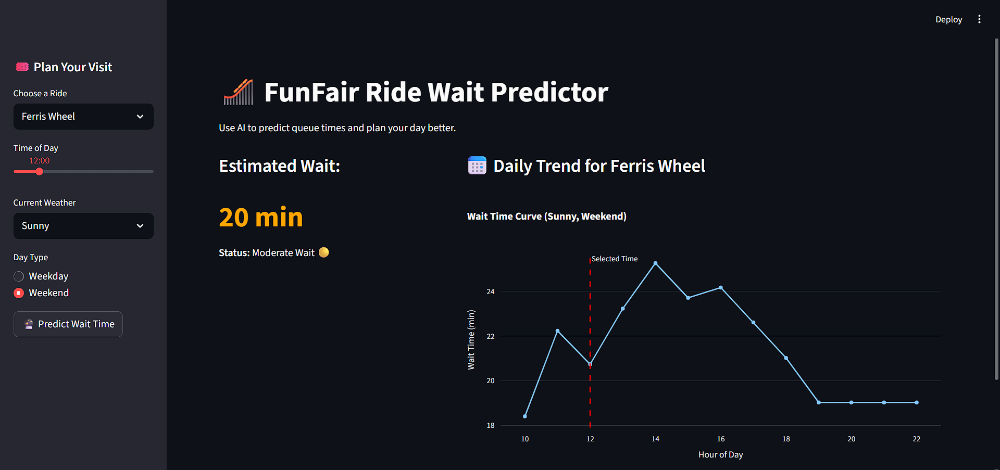

# 🎢 FunFair AI: Ride Wait Time Predictor

**Role:** AI Engineer Take-Home Challenge  
**Status:** Completed

## 🧠 Overview
This project is an AI-powered application that predicts queue wait times for funfair rides. By analyzing factors like **weather, time of day, and day of the week**, the system helps visitors plan their trip to avoid long lines.

The solution includes:
1.  **Data Simulation Engine:** A Python script to generate realistic synthetic data based on park dynamics.
2.  **Machine Learning Pipeline:** A Random Forest model to predict wait times (MAE: ~4 minutes).
3.  **Interactive Dashboard:** A Streamlit web app for real-time predictions.

## 🚀 How to Run

### 1. Prerequisites
Ensure you have Python installed.

```bash
# Clone the repository (if applicable) or unzip the folder
cd funfair-wait-predictor

# Install dependencies
pip install -r requirements.txt

# Run the app
python -m streamlit run app/main.py
```

### 2. Example working app


## Data Simulation (notebooks/01_data_simulation.ipynb)
Since real-time funfair data is proprietary, I built a simulation engine to generate 3 months of historical data (approx. 4,000 samples).
### Assumptions & Logic:
1. Peak Hours: Wait times follow a bell curve, peaking at 2 PM.
2. Weather Impact: Rain reduces crowd size by 40%.
3. Weekends: Traffic increases by 50% on Saturdays and Sundays.
4. Rides: Modeled 4 distinct rides (e.g., Mega Coaster has high capacity but high demand).

## Model Development (notebooks/02_model_training.ipynb)
1. Algorithm: RandomForestRegressor (Scikit-Learn).
2. Why: Chosen for its ability to handle non-linear relationships (like the afternoon peak) and categorical data (Weather/Ride ID) without complex scaling.
3. Performance:
- MAE (Mean Absolute Error): ~4.01 minutes.
- Interpretation: The model's predictions are accurate within +/- 4 minutes on average.

## IoT Integration Strategy (Real-World Deployment)
1. Data Collection (The Sensors):
- Entrance/Exit Counters: Infrared break-beam sensors or turnstiles at the ride entrance to count inflows.
- Queue Cameras: Use Computer Vision (YOLO) on CCTV feeds to estimate crowd density in the waiting area.
- Ride Cycle Telemetry: Sensors on the ride itself to track dispatch_rate (how fast cars are leaving).

2. Data Transmission:
- Sensors send JSON payloads via MQTT (lightweight IoT protocol) to an AWS IoT Core broker.
- Example Payload: {"sensor_id": "R_001_CAM", "people_count": 45, "timestamp": "14:05:00"}.

3. Real-Time Inference:
- The Streamlit app would connect to a Time-Series Database (InfluxDB) to get the live current_queue_length.
- The model would periodically retrain (every Sunday night) to adapt to changing trends (e.g., summer holidays).